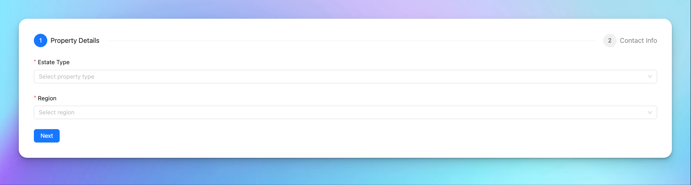

# Reas Technical Assignment

This is a full-stack application built with React, TypeScript, TailwindCSS, and Axios for the frontend, and Node.js, JavaScript, and Express.js for the backend, using MongoDB as the database.

Visit on Vercel: [Reas Technical Assignment](https://reas-technical-assignment.vercel.app/)

## Installations

Follow these steps to install and run the application on your local machine.

### Frontend Installation

1. Navigate to the `client` folder:

   ```bash
   cd ./client
   ```

2. Install the required dependencies:

   ```bash
   npm install
   ```

3. Start the development server:

   ```bash
   npm run dev
   ```

   The frontend will now be running on `http://localhost:5137`.

### Backend Installation

1. Navigate to the `server` folder:

   ```bash
   cd ./server
   ```

2. Install the required dependencies:

   ```bash
   npm install
   ```

3. Start the backend server:

   ```bash
   node app.js
   ```

   The backend will now be running on `http://localhost:3000`.

## Running the Application

1. Ensure that both the frontend and backend servers are running. The frontend will connect to the backend API to handle data operations like reading and writing to the MongoDB database.

2. Visit `http://localhost:5137` in your browser to use the application.

## Technologies Used

### Frontend
- **React**
- **TypeScript**
- **TailwindCSS**
- **Axios**

### Backend
- **Node.js**
- **Express.js**
- **MongoDB**


